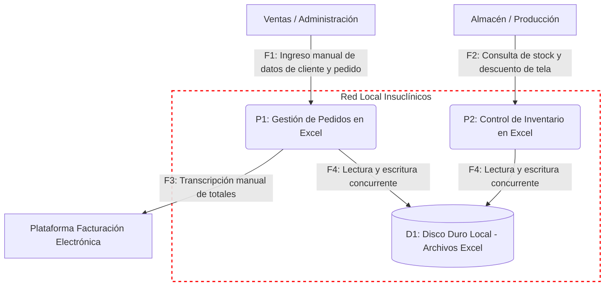

# 📄 Informe Técnico del Taller

## 🔖 Nombre del Taller
Taller 5 - Evaluación de Seguridad con STRIDE aplicado a Insuclínicos Ltda.

## 👥 Integrantes del equipo
* Jorge Steven Doncel (gevengood)
* David Santiago Buendia Londoño (Santiagoob7)

## 🧠 Descripción general del trabajo
El objetivo de este taller fue aplicar el marco de modelado de amenazas STRIDE para evaluar la seguridad de la arquitectura actual (AS-IS) de Insuclínicos Ltda. El análisis se centró en el macro-proceso crítico de **Gestión y Cumplimiento de Pedido**, específicamente en el ecosistema de control operativo basado en archivos locales de Microsoft Excel y la comunicación mediante WhatsApp. A través de este ejercicio, se identificaron vulnerabilidades estructurales en el manejo de la información y se propusieron mitigaciones técnicas viables acordes a las restricciones presupuestales y operativas del cliente.

## 🔧 Proceso de desarrollo
El trabajo se desarrolló siguiendo una metodología estructurada en 5 pasos:
1. **Selección y delimitación:** A partir de los modelos previos (BPMN y ArchiMate AS-IS), acotamos el análisis al PC de Administración, que actúa como el núcleo de datos (pedidos e inventario).
2. **Construcción del DFD:** Dibujamos el diagrama de flujo de datos estableciendo un límite de confianza claro alrededor de la red local y el disco duro donde residen los archivos críticos.
3. **Reconocimiento Pasivo:** En lugar de lanzar ataques, analizamos la topología AS-IS documentada (uso de hardware físico sin redundancia, carpetas compartidas, sesiones locales).
4. **Aplicación de STRIDE:** Redactamos 6 escenarios de amenaza específicos (Suplantación, Alteración, Repudio, Divulgación, Denegación de Servicio y Elevación de Privilegios) adaptados a un entorno de ofimática local, alejándonos de los ejemplos web tradicionales.
5. **Priorización:** Clasificamos los riesgos, destacando como críticos la Denegación de Servicio (punto único de falla del disco duro) y la Alteración (falta de integridad en los Excel).

## 🧩 Análisis del modelo propuesto
El modelo de amenazas entregado refleja de manera precisa la realidad operativa de la PyME. Se estructuró bajo el supuesto de que Insuclínicos no cuenta actualmente con infraestructura en la nube, Active Directory, ni políticas formales de ciberseguridad. 
Las necesidades del cliente frente a la trazabilidad de inventario chocan directamente con los riesgos de **Alteración (Tampering)** y **Repudio (Repudiation)** detectados: al depender de celdas no protegidas y sin historial de versiones, cualquier error humano corrompe la operación. Las mitigaciones propuestas (GPOs, RBAC en NTFS, respaldos 3-2-1 y protección nativa de Office) fueron seleccionadas estratégicamente para mejorar la postura de seguridad sin requerir inversiones inmediatas en licencias de software empresarial.

## 📈 Diagrama final entregado

## 📋 Tabla de componentes y amenazas STRIDE (Insuclínicos Ltda.)

A partir del Diagrama de Flujo de Datos (DFD) y el análisis de la arquitectura actual, se evaluaron las 6 categorías del marco STRIDE sobre los componentes operativos de la empresa:

| ID | Componente / Activo | Tipo STRIDE | Descripción de la Amenaza | Impacto | Nivel de Riesgo | Mitigación Recomendada | Responsable |
|:--:|:---|:---:|:---|:---:|:---:|:---|:---|
| **T1** | PC Administración / Usuario | **Spoofing** (Suplantación) | Operario o externo utiliza la sesión abierta del PC administrativo sin autenticación previa. | Medio | **Medio** | Implementar perfiles de usuario individuales con contraseñas seguras y bloqueo automático por inactividad. | Administración |
| **T2** | Disco Duro Local (Archivos Excel) | **Tampering** (Alteración) | Modificación accidental o intencionada de fórmulas y registros de existencias de tela o pedidos. | Alto | **Alto** | Proteger celdas críticas y libros con contraseña nativa; establecer permisos de solo lectura para operarios. | Administración |
| **T3** | Control de Inventario (Excel) | **Repudiation** (Repudio) | Modificación de existencias sin registro de autoría, imposibilitando rastrear quién descontó material. | Medio | **Alto** | Migrar hacia un registro transaccional con bitácora de auditoría en la arquitectura TO-BE. | Administración / Sistemas |
| **T4** | Archivos Excel / WhatsApp | **Information Disclosure** (Divulgación) | Extracción no autorizada de cotizaciones, precios especiales o datos de clientes corporativos vía USB o chat. | Alto | **Medio** | Cifrado de archivos locales en reposo y definición de acuerdos de confidencialidad con los colaboradores. | Gerencia / Legal |
| **T5** | Disco Duro Local PC Administración | **Denial of Service** (Denegación) | Pérdida total de acceso por fallo mecánico del disco duro, daño eléctrico o infección por malware/ransomware. | Alto | **Alto** | Implementar política de respaldos automatizados bajo esquema 3-2-1 con copia cifrada en almacenamiento cloud. | Administración / Proveedor TI |
| **T6** | Red Local / Lectura concurrente | **Elevation of Privilege** (Elevación) | Empleados de planta acceden a carpetas compartidas con permisos completos de edición financiera. | Medio | **Medio** | Restringir permisos de red NTFS aplicando el principio de menor privilegio (PoLP). | Administración |

---

## 🔍 Investigación complementaria

### Tema investigado:
Estrategias pragmáticas de ciberseguridad y modelado de amenazas STRIDE en entornos con TI en la sombra (*Shadow IT*) y ofimática descentralizada para microempresas.

### Resumen:
En empresas de manufactura ligera de escala PyME (como Insuclínicos Ltda.), la infraestructura tecnológica suele carecer de cortafuegos dedicados, servidores de dominio o arquitecturas de microservicios. En estos contextos, los procesos críticos se sostienen sobre soluciones informales desarrolladas por los propios usuarios (*Shadow IT*), tales como libros de Microsoft Excel compartidos mediante unidades de red o carpetas locales, y canales comerciales por mensajería instantánea.

La literatura de ciberseguridad (CISA y el marco NIST CSF) advierte que aplicar STRIDE a estos sistemas requiere una aproximación pragmática: no se trata de auditar vulnerabilidades web como SQLi o XSS en servidores inexistentes, sino de identificar las fallas en los controles básicos de integridad, autenticación y disponibilidad. Para Insuclínicos, el análisis demostró que las amenazas más peligrosas corresponden a la **Denegación de Servicio (DoS)** por ausencia de redundancia física en el almacenamiento local, y a la **Alteración (Tampering)** por la inexistencia de controles de concurrencia y validación en las hojas de cálculo.

Modernizar la postura de seguridad de estas organizaciones no exige la adquisición inmediata de costosas suites de ciberseguridad empresarial. La investigación confirma que la adopción de controles de **higiene digital básica** —como la regla de respaldo 3-2-1 (tres copias, dos medios distintos, una fuera de sede), el control de acceso basado en roles (RBAC) a nivel de sistema operativo y el cifrado nativo de archivos en reposo— permite mitigar hasta un 80% de los riesgos identificados, sentando la base de confianza requerida antes de abordar la migración hacia un sistema ERP/CRM centralizado en la nube.

---

## 📚 Referencias

- [1] Microsoft Corporation. (2022). *The STRIDE Threat Model*. Microsoft Security Engineering Guide. https://learn.microsoft.com/en-us/azure/security/develop/threat-modeling-tool-threats
- [2] Cybersecurity and Infrastructure Security Agency — CISA. (2023). *Data Backup Options and the 3-2-1 Rule*. CISA Insights. https://www.cisa.gov/
- [3] OWASP Foundation. (2021). *OWASP Top 10:2021 — The Ten Most Critical Web Application Security Risks*. https://owasp.org/Top10/
- [4] Microsoft Corporation. (2023). *Access Control and NTFS Permissions Overview*. Windows Security Documentation. https://learn.microsoft.com/en-us/windows/security/
- [5] Universidad de La Sabana. (2026). *Guía Paso a Paso: Evaluación de Seguridad con STRIDE*. Material docente del curso AREM.
- [6] Insuclínicos Ltda. (2026). *Ficha de Caracterización y Documento de Visión de Arquitectura*. Repositorio del proyecto AREM.

---

_Este documento hace parte de la entrega del Taller 5 del curso AREM (Arquitectura Empresarial) — Universidad de La Sabana._
