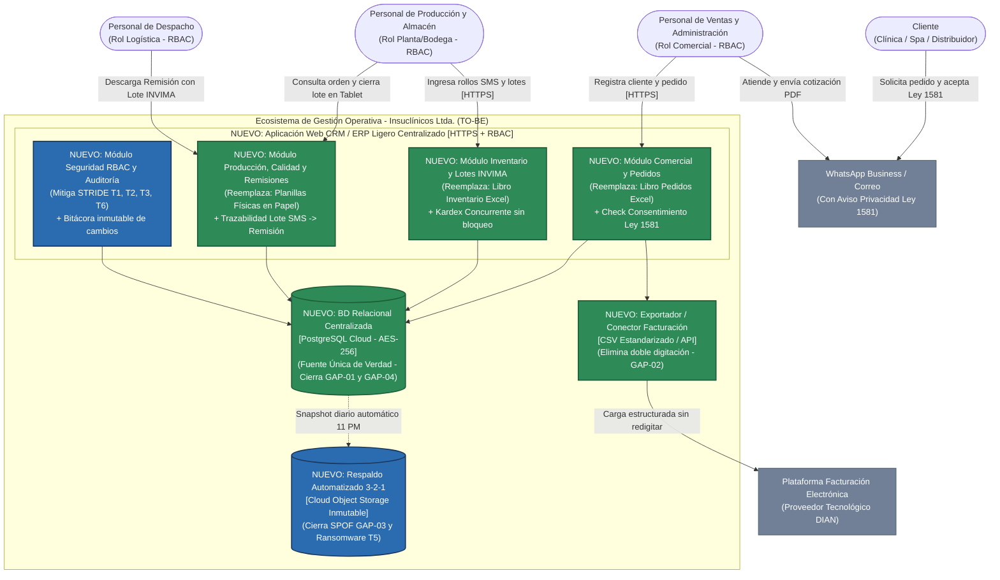
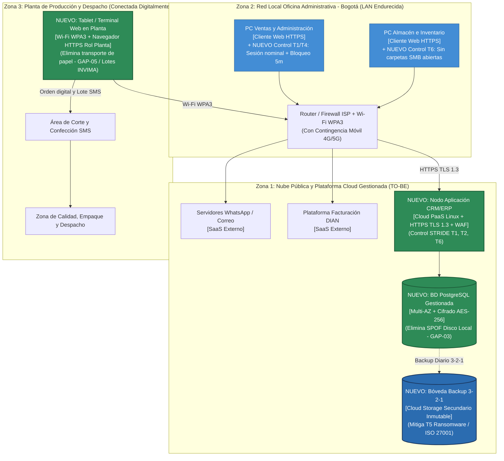
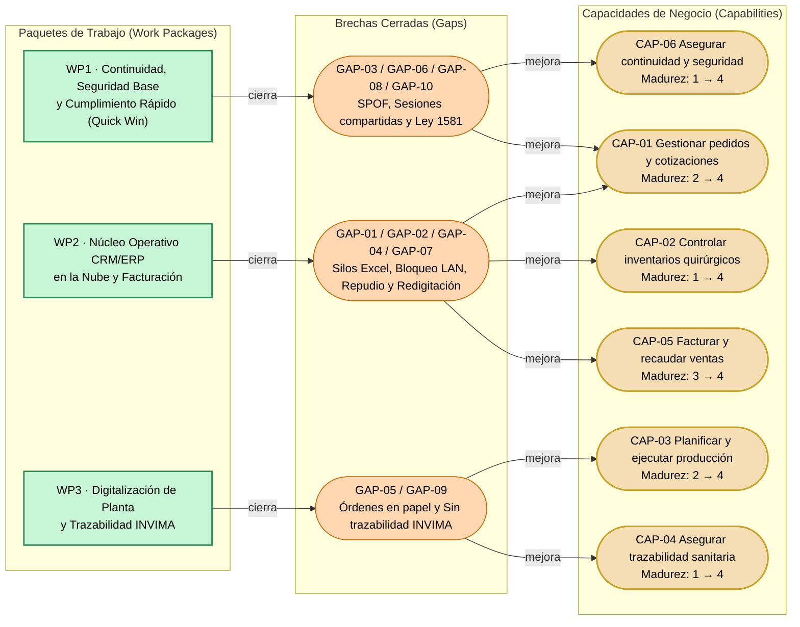
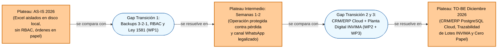

# Mejora de Arquitectura (TO-BE) — Identificación y Priorización de Mejoras

## Cliente
**Insuclínicos Ltda.** — Empresa manufacturera y comercializadora de ropa e insumos médicos quirúrgicos desechables en tela no tejida (SMS) ubicada en Bogotá D.C., Colombia (6 empleados de planta y administración; atención a ~40 clínicas, centros estéticos y distribuidores).

## Integrantes del equipo (Grupo 8)
- **Jorge Steven Doncel Bejarano** (`@gevengood`)
- **David Santiago Buendia Londoño** (`@Santiagoob7`)

---

## 1. Diagnóstico inicial

El presente diagnóstico consolida con trazabilidad estricta los hallazgos levantados en el modelo de procesos BPMN (Taller 1), el modelo conceptual de datos (Taller 2), la arquitectura de aplicaciones C4 (Taller 3), el mapa de infraestructura (Taller 4), la evaluación de amenazas STRIDE (Taller 5) y la auditoría de cumplimiento normativo (Taller 6), sin introducir hallazgos sin respaldo previo.

### 1.1 Respuesta a las preguntas orientadoras

#### A. ¿Cuáles son los procesos o tecnologías que generan mayor fricción en la operación?
1. **Fragmentación en silos de hojas de cálculo locales (Taller 3 — C2 Contenedores):** La operación descansa sobre dos archivos independientes de Microsoft Excel (`Libro de Pedidos y Cotizaciones.xlsx` y `Libro de Control de Inventario.xlsx`) que no se comunican entre sí. Cuando Ventas recibe un pedido por WhatsApp, debe abrir manualmente el archivo de inventario para verificar existencias de rollos de tela SMS o prendas terminadas, generando retrasos y ventas sobre stock inexistente.
2. **Bloqueos de concurrencia en red local (Taller 4 — Mapa de Infraestructura):** Al compartir los archivos Excel en una carpeta de red local (LAN) entre el `PC Ventas / Administración` y el `PC Almacén / Inventario`, el sistema operativo bloquea el archivo en modo *"Solo lectura"* cuando ambos roles intentan trabajar al mismo tiempo, o produce copias en conflicto (`Inventario_copia(1).xlsx`).
3. **Doble digitación hacia la facturación electrónica y transporte físico de papel a planta (Talleres 1, 3 y 4):** Para emitir una factura, el área administrativa vuelve a digitar manualmente cliente, NIT, ítems y precios en el portal web del proveedor de Facturación Electrónica DIAN. Adicionalmente, las órdenes de producción y remisiones se imprimen o escriben a mano en papel y se transportan físicamente a la planta de corte y confección.

#### B. ¿Qué problemas recurrentes señalaron los usuarios o el cliente en las entrevistas?
En las sesiones de levantamiento con **Santiago Martínez** (contacto del cliente en Insuclínicos Ltda.) y el personal operativo (Talleres 0, 1 y 3), se reportaron de forma reiterada cuatro dolores de negocio:
- **Descuadres frecuentes de inventario de tela quirúrgica SMS:** Diferencias entre los rollos que figuran en el Excel y los que realmente existen en bodega, provocando paros de producción de último minuto.
- **Pérdida de tiempo administrativo (~6 horas semanales):** Tiempo invertido en conciliar manualmente qué pedidos de WhatsApp ya fueron pagados, cuáles están en confección, cuáles ya se despacharon y cuáles faltan por facturar.
- **Errores de transcripción y precios desactualizados:** Cotizaciones armadas copiando y pegando filas de Excel donde se alteran accidentalmente fórmulas de precios mayoristas o cantidades.
- **Imposibilidad de rastrear qué rollo de tela se usó en cada pedido:** Cuando una clínica solicita soporte de calidad de un lote de batas o kits quirúrgicos, el equipo debe buscar entre planillas de papel archivadas sin un código único que conecte materia prima con entrega.

#### C. ¿Qué vulnerabilidades de seguridad o riesgos quedaron evidenciados en el análisis previo?
- **Riesgo Crítico de Punto Único de Falla (SPOF) y Denegación de Servicio (`T5` — Talleres 4 y 5):** El 100 % de los registros de pedidos e inventario reside en el `Disco Duro Local (Archivos Excel)` de un computador de oficina sin esquema de copias de seguridad automatizadas (regla 3-2-1). Un fallo mecánico del disco o una infección por *ransomware* paralizaría a la empresa de inmediato.
- **Suplantación, Manipulación, Repudio y Elevación de Privilegios (`T1`, `T2`, `T3`, `T6` — Taller 5 STRIDE):** Los computadores de oficina utilizan sesiones genéricas compartidas sin autenticación nominal (`T1`) y carpetas LAN con permisos abiertos (`T6`). Cualquier usuario puede modificar celdas de precios o descontar inventario sin validación (`T2`) y Excel no guarda una bitácora inmutable de auditoría para saber quién realizó el cambio (`T3`), además del riesgo de fuga de la base de clientes por USB o WhatsApp (`T4`).
- **Riesgos Legales y Sanitarios Críticos (Taller 6 — Normatividad):**
  1. **INVIMA (Decreto 4725 de 2005 y Resolución 4816 de 2008):** Ausencia de trazabilidad sistematizada de lotes desde el rollo de tela SMS del proveedor hasta la remisión entregada a la clínica, impidiendo ejecutar un retiro efectivo de producto (*recall*) ante una alerta de tecnovigilancia.
  2. **Ley 1581 de 2012 (Habeas Data):** Recolección de datos personales y comerciales de clientes por WhatsApp y correo sin aviso de privacidad ni registro verificable de autorización previa.
  3. **ISO/IEC 27001:2022:** Incumplimiento de controles de respaldo (`A.8.13`), control de acceso basado en roles (`A.5.15`) y registro de eventos (`A.8.15`).

### 1.2 Resumen del problema actual (Foto del AS-IS y Brechas Consolidadas)

Hoy Insuclínicos Ltda. opera su cadena de valor sobre una arquitectura *Shadow IT* basada en hojas de Excel locales aisladas, mensajes de WhatsApp sin formalización legal y órdenes en papel. Esta estructura fue suficiente cuando la empresa inició, pero con ~40 clínicas activas genera cuellos de botella diarios por bloqueo de archivos, expone el negocio a pérdida total de información por falta de backups y mantiene brechas abiertas frente al INVIMA y la Ley 1581.

| ID Brecha | Tipo de Brecha | Taller de Origen | Evidencia en el AS-IS |
|---|---|---|---|
| **GAP-01** | Funcional / Aplicaciones | Taller 3 (C2) y Taller 1 (BPMN) | Silos desconectados entre `Libro de Pedidos y Cotizaciones [Excel]` y `Libro de Control de Inventario [Excel]`. |
| **GAP-02** | Funcional / Aplicaciones | Taller 3 (C2) | Doble digitación manual desde el Excel de pedidos hacia la `Plataforma de Facturación Electrónica`. |
| **GAP-03** | Técnica / Infraestructura | Taller 4 (Mapa Infraestructura) | Punto Único de Falla (SPOF Crítico) en `Disco Duro Local (Archivos Excel)` sin redundancia ni copias en nube. |
| **GAP-04** | Técnica / Infraestructura | Taller 4 (Mapa Infraestructura) | Cuello de botella por bloqueo de concurrencia al abrir el mismo archivo Excel desde Ventas y Almacén en LAN. |
| **GAP-05** | Técnica / Aplicaciones | Talleres 3 y 4 | Desconexión de la `Planta de Producción`: órdenes de corte/confección y calidad transportadas manualmente en papel. |
| **GAP-06** | Seguridad (STRIDE) | Taller 5 (`T1`, `T6`) y Taller 6 | Sesiones de Windows compartidas y carpetas LAN abiertas sin control de acceso basado en roles (RBAC). |
| **GAP-07** | Seguridad (STRIDE) | Taller 5 (`T2`, `T3`) | Celdas de precios/stock editables sin restricción y ausencia de bitácora (logs) inmutable contra el repudio. |
| **GAP-08** | Seguridad (STRIDE) | Taller 5 (`T4`, `T5`) y Taller 6 | Riesgo de exfiltración de cartera de clientes por USB/WhatsApp y pérdida total ante *ransomware* sin Backup 3-2-1. |
| **GAP-09** | Cumplimiento (INVIMA) | Taller 6 (Dec. 4725 / Res. 4816) | Sin trazabilidad de lotes que vincule el rollo de tela SMS del proveedor con la orden de producción y la remisión. |
| **GAP-10** | Cumplimiento (Ley 1581) | Taller 6 (Habeas Data) | Captura de datos de clientes en WhatsApp y cotizaciones sin aviso de privacidad ni prueba de autorización previa. |

---

## 2. Propuesta de mejoras

### 2.1 Lluvia de ideas (sin censura inicial)

Antes de filtrar o elegir una arquitectura, el equipo generó **8 ideas de mejora** combinando intervenciones de proceso, comunicación con el cliente, seguridad, cumplimiento normativo y tecnología:

| # | Idea de mejora | Tipo | Brecha(s) del diagnóstico que atiende |
|---|---|---|---|
| **1** | **Configurar respaldos automáticos diarios (Regla 3-2-1) y cuentas nominales por empleado:** programar copia cifrada diaria de los archivos críticos hacia almacenamiento en nube secundaria y separar usuarios de Windows/sistema con bloqueo a los 5 minutos. | Seguridad / Infraestructura | `GAP-03`, `GAP-06`, `GAP-08` (`T1`, `T5`, `T6`) |
| **2** | **Estandarizar el mensaje de bienvenida de WhatsApp Business con aviso de privacidad Ley 1581 y formato único de pedido:** respuesta automática con enlace a la Política de Tratamiento de Datos y plantilla estructurada de solicitud. | Comunicación / Cumplimiento | `GAP-10` (Ley 1581 de 2012) |
| **3** | **Implementar un CRM/ERP Ligero en la Nube (SaaS/PaaS como Odoo o Dolibarr Cloud):** reemplazar las hojas de Excel de Pedidos e Inventario por una aplicación web centralizada con base de datos relacional PostgreSQL, control de acceso por roles (RBAC) y bitácora de auditoría. | Tecnología / Aplicaciones / Seguridad | `GAP-01`, `GAP-03`, `GAP-04`, `GAP-06`, `GAP-07` (`T1`–`T6`) |
| **4** | **Digitalizar el control de lotes INVIMA y las órdenes en planta mediante una Tablet/Terminal Web:** registrar el código de lote del rollo SMS al ingresar a almacén, asociarlo en pantalla a la orden de corte/confección e imprimirlo automáticamente en la remisión digital del cliente. | Proceso / Cumplimiento / Tecnología | `GAP-05`, `GAP-09` (INVIMA Dec. 4725 / Res. 4816) |
| **5** | **Habilitar un exportador/conector estructurado (CSV/API) hacia la Plataforma de Facturación Electrónica:** generar desde el pedido aprobado el archivo de carga directa para evitar redigitar datos en el portal DIAN. | Tecnología / Proceso | `GAP-02` |
| **6** | **Migrar los libros de Excel actuales a Microsoft OneDrive / SharePoint con hojas protegidas por contraseña:** mantener la operación en Excel pero alojada en la nube de Office 365. | Tecnología (Conservadora) | `GAP-03`, `GAP-04` (Parcialmente) |
| **7** | **Desarrollar desde cero un software web a la medida (Node.js + React + PostgreSQL) exclusivo para Insuclínicos:** construir internamente todos los módulos comerciales, de planta e inventario. | Tecnología | `GAP-01`, `GAP-04`, `GAP-05`, `GAP-09` |
| **8** | **Implementar un chatbot con IA generativa conectado a WhatsApp para cotizar automáticamente ropa quirúrgica:** agente autónomo que consulte precios y responda a las clínicas 24/7. | Comunicación / IA (Backlog) | Mejora tiempos comerciales, pero no resuelve las brechas base de inventario/INVIMA hoy |

### 2.2 Priorización (3 soluciones estratégicas seleccionadas, con justificación)

Cruzando **Impacto vs. Esfuerzo** y considerando las restricciones reales de Insuclínicos Ltda. (PyME de 6 trabajadores, presupuesto acotado y urgencia regulatoria), se priorizan **3 paquetes de solución complementarios** (agrupando las ideas #1, #2, #3, #4 y #5, y descartando #6, #7 y #8 por las razones demostradas en la matriz de decisión de la sección 2.3):

| Solución priorizada | Esfuerzo | Impacto | Horizonte (Quick Win / Mediano Plazo) | Justificación de negocio, técnica y normativa |
|---|---|---|---|---|
| **Solución 1 (Ideas #1 y #2): Endurecimiento de Seguridad Base, Backup 3-2-1 y Cumplimiento Ley 1581 en WhatsApp** (`WP1`) | **Bajo** (1 a 2 semanas) | **Alto** | **Quick Win** (Efecto inmediato sin esperar el cambio de software) | Cierra de inmediato el riesgo existencial de pérdida total de datos (`GAP-03`, `GAP-08` / `T5`), elimina las sesiones genéricas compartidas en los PCs (`GAP-06` / `T1`, `T6`) y subsana el incumplimiento de Habeas Data en WhatsApp (`GAP-10`) con costo marginal cercano a cero. |
| **Solución 2 (Ideas #3 y #5): Adopción de CRM/ERP Ligero Centralizado en la Nube (Odoo/Dolibarr Cloud) con Base de Datos PostgreSQL y Exportador de Facturación** (`WP2`) | **Medio** (6 a 8 semanas) | **Alto** | **Mediano Plazo** (Núcleo de la transformación TO-BE) | Resuelve de raíz la fragmentación entre Pedidos e Inventario (`GAP-01`), elimina los bloqueos de concurrencia de Excel (`GAP-04`), incorpora validación de precios y bitácora inmutable contra el repudio (`GAP-07` / `T2`, `T3`) y suprime la doble digitación hacia Facturación Electrónica (`GAP-02`). |
| **Solución 3 (Idea #4): Digitalización de Planta con Terminal Web (Tablet) y Módulo de Trazabilidad de Lotes INVIMA** (`WP3`) | **Medio** (4 semanas tras `WP2`) | **Alto** | **Mediano / Largo Plazo** (Consolidación operativa y sanitaria) | Reemplaza el transporte manual de hojas de papel a la planta (`GAP-05`) y asegura la trazabilidad completa del lote de tela quirúrgica SMS desde el proveedor hasta la remisión entregada a la clínica (`GAP-09`), cumpliendo el Decreto 4725 de 2005 y la Resolución 4816 de 2008. |

---

### 2.3 Matriz de Decisión Ponderada (Marco de 8 pasos)

Para resolver las brechas nucleares **`GAP-01` (silos de Excel), `GAP-03` (SPOF local), `GAP-04` (bloqueo concurrente) y `GAP-07` (integridad y no repudio)** existen múltiples alternativas tecnológicas (Ideas #3, #6 y #7). A continuación se aplica el marco formal de 8 pasos de la guía:

#### Paso 1 — Problema en términos de impacto
Cada semana, el personal de Insuclínicos Ltda. pierde **~6 horas operativas** conciliando manualmente pedidos frente a existencias y redigitando facturas; sufre **2 a 3 bloqueos diarios** de lectura/escritura cuando Ventas y Almacén abren simultáneamente los archivos locales; desconoce el origen de descuadres de rollos de tela quirúrgica SMS por falta de rastro de auditoría; y enfrenta una exposición del **100 % de parálisis operativa y pérdida de cartera** ante una falla del disco duro local o incidente de *ransomware*, además de sanciones sanitarias del INVIMA por no poder rastrear lotes en menos de 24 horas.

#### Paso 2 — Último momento responsable para decidir

| Dato | Valor verificado |
|---|---|
| **Fecha en que el problema empieza a doler críticamente** | **1 de diciembre de 2026** (inicio del pico de pedidos de clínicas estéticas y quirúrgicas de fin de año y cierre contable/sanitario anual). |
| **Tiempo que necesita la opción más probable (implementación + migración + pruebas)** | **6 semanas** (42 días calendario para parametrizar, migrar maestros de ~40 clínicas y capacitar a los 6 empleados). |
| **Último momento responsable para decidir** (fecha límite − tiempo necesario) | **19 de octubre de 2026**. |
| **Fecha de hoy y margen disponible** | **3 de octubre de 2026** (quedan **16 días** de margen antes del último momento responsable). |

#### Paso 3 — Criterios, pesos y escala (definidos y validados con el negocio)
Los pesos fueron validados con la gerencia de Insuclínicos Ltda., priorizando la integridad del inventario/trazabilidad INVIMA y la viabilidad financiera para una PyME de 6 personas. En todos los criterios, **5 es siempre lo más favorable**.

| Criterio | Peso (%) | Qué significa 5 (Más favorable) | Qué significa 3 (Aceptable) | Qué significa 1 (Menos favorable) |
|---|---|---|---|---|
| **C1. Integridad transaccional, concurrencia y trazabilidad INVIMA** | **30 %** | Base de datos relacional ACID multiusuario con control nativo de lotes (materia prima → producto → remisión) y bloqueo de stock en vivo. | Soporta varios usuarios, pero el control de lotes exige pasos manuales propensos a olvido. | Archivos sueltos donde un usuario puede sobrescribir fórmulas/celdas o sin relación entre lote y pedido. |
| **C2. Costo Total de Propiedad Anual (TCO: licencias + nube + soporte)** | **25 %** | Menos de `\$2.500.000 COP/año` en total para los 6 usuarios. | Entre `\$2.500.000` y `\$6.000.000 COP/año`. | Más de `\$6.000.000 COP/año` o inversión inicial > `\$10.000.000 COP`. |
| **C3. Tiempo de puesta en marcha (Time-to-Market)** | **20 %** | Operativo en `<= 3 semanas`. | Operativo entre `4 y 8 semanas` (llega a tiempo para el 1 de diciembre). | Más de `12 semanas` (no llega al pico de fin de año). |
| **C4. Facilidad de adopción por los 6 empleados (Usabilidad)** | **15 %** | Uso inmediato sin capacitación o interfaz web guiada que se domina en `<= 2 sesiones` prácticas. | Requiere `2 a 4 semanas` de acompañamiento constante. | Alta complejidad técnica o rechazo operativo severo. |
| **C5. Seguridad integrada (STRIDE) y cumplimiento (Ley 1581 / ISO 27001)** | **10 %** | Incluye de fábrica RBAC nominal, HTTPS/AES-256, bitácora de auditoría inmutable y backup 3-2-1 diario. | Cumple autenticación básica pero carece de bitácora por campo o backups automáticos. | Mantiene permisos abiertos sin trazabilidad de quién modificó qué dato. |
| **Total** | **100 %** | | | |

- **Por qué esos pesos:** Para Insuclínicos, eliminar los descuadres de tela SMS y cumplir con la trazabilidad de lotes del INVIMA (**C1: 30 %**) es la razón principal del proyecto, seguida de cerca por no desfinanciar el flujo de caja de una microempresa de 6 empleados (**C2: 25 %**) y estar listos antes de la temporada alta de diciembre (**C3: 20 %**).
- **Criterio eliminatorio obligatorio:** *«Toda opción con puntaje menor a **3** en **C1 (Integridad transaccional y trazabilidad INVIMA)** se descarta automáticamente, pues dejaría abierta la brecha regulatoria sanitaria `GAP-09` y el riesgo de manipulación `T2`/`T3`».*

#### Paso 4 — Opciones evaluadas (incluyendo una radicalmente distinta / conservadora)

| Opción | Descripción |
|---|---|
| **Opción A — CRM/ERP Ligero en la Nube (SaaS/PaaS: Odoo / Dolibarr Cloud)** | Adoptar una plataforma CRM/ERP estándar para PyMEs alojada en la nube con motor PostgreSQL, activando únicamente los módulos de Clientes/Cotizaciones, Inventario con Lotes, Producción simple y Auditoría RBAC para los 6 usuarios. |
| **Opción B — Desarrollo de Software Web a la Medida desde Cero** | Construir internamente o contratar el desarrollo desde cero de una aplicación web propietaria (Backend Node.js/Python, Frontend React y BD PostgreSQL en la nube) diseñada exclusivamente para el flujo de Insuclínicos. |
| **Opción C — Mantener hojas de Excel migradas a OneDrive / SharePoint (Radicalmente distinta: mínimo cambio técnico)** | Conservar los libros de Excel actuales sin cambiar de herramienta, subiéndolos a una cuenta compartida de Microsoft 365 (OneDrive) con coautoría web, protección de celdas con contraseña y reglas operativas manuales. |

#### Paso 5 — Consejo consultado

| A quién (quien sabe / a quien le afecta) | Qué aportó (dato verificable) | Qué opción afecta |
|---|---|---|
| **Santiago Martínez (Gerente / Contacto Cliente)** | Confirmó que el presupuesto anual máximo para tecnología no debe superar `\$3.000.000 COP/año` y que necesitan trazabilidad de lotes lista antes de diciembre. | Penaliza **Opción B** en C2 y C3; favorece **A** y **C** en C2. |
| **Personal de Ventas y Almacén (Usuarios afectados)** | Señalaron que en Excel suelen olvidar registrar el lote del rollo SMS si el sistema no se los exige como campo obligatorio antes de guardar la remisión. | Penaliza **Opción C** en C1 y C5; favorece **Opción A** por formularios con campos obligatorios. |
| **Revisión técnica de proveedores Cloud (Odoo / Hostinger / AWS Lightsail)** | Instancia gestionada de Dolibarr/Odoo para 6 usuarios con PostgreSQL y backups diarios cuesta entre `\$150.000 y \$230.000 COP/mes` (`~1.8M a 2.76M COP/año`) y se parametriza en `5–6 semanas`. | Sustenta los puntajes de **Opción A** en C1, C2, C3 y C5. |

#### Paso 6 — Puntajes con justificación celda por celda

| Opción | C1. Integridad y Lotes INVIMA (30 %) | C2. Costo Anual TCO (25 %) | C3. Tiempo Puesta en Marcha (20 %) | C4. Facilidad de Adopción (15 %) | C5. Seguridad STRIDE y Normativa (10 %) |
|---|---|---|---|---|---|
| **Opción A (CRM/ERP Cloud)** | **5** — BD PostgreSQL ACID multiusuario; obliga a asociar lote SMS a orden y remisión (Paso 5). | **4** — `~\$2.200.000 COP/año` en nube gestionada con backups incluidos; dentro del tope de gerencia. | **4** — `5 a 6 semanas` parametrizando módulos ya existentes e importando catálogo CSV. | **4** — Vistas web limpias filtradas por rol; requiere 2 talleres prácticos con los 6 empleados. | **5** — Trae RBAC nominal, HTTPS, cifrado en reposo, logs inmutables (`T1`–`T6`) y backup diario. |
| **Opción B (Desarrollo a Medida)** | **4** — BD relacional ACID, pero los módulos de lotes y kardex recién programados tienen riesgo de bugs iniciales. | **1** — Costo de desarrollo estimado `> \$15.000.000 COP` + servidor mensual; supera 5 veces el presupuesto. | **1** — `16 a 24 semanas` de desarrollo, pruebas y despliegue; incumple la fecha del 1 de diciembre. | **3** — Interfaz adaptable, pero requiere semanas de estabilización con los operarios. | **3** — Exige programar manualmente RBAC, logs de auditoría y backups sin errores de seguridad. |
| **Opción C (Excel en OneDrive)** | **2** *(Eliminatorio)* — Aunque permite coautoría, no es una BD relacional; permite borrar filas por error y no garantiza trazabilidad INVIMA. | **5** — `~\$900.000 COP/año` con suscripción básica Microsoft 365. | **5** — `1 a 2 semanas` subiendo los archivos actuales a OneDrive. | **4** — El equipo ya usa Excel, aunque la coautoría web genera confusión cuando filtran tablas al tiempo. | **2** — No ofrece bitácora transaccional inmutable por campo (`T3`) ni control granular RBAC por operación (`T6`). |

**Totales ponderados paso a paso** ($\text{Total} = \sum \text{Puntaje}_i \times \text{Peso}_i$):

| Opción | Cálculo detallado | Total Ponderado | Estado |
|---|---|---|---|
| **Opción A (CRM/ERP Cloud)** | $(5 \times 0.30) + (4 \times 0.25) + (4 \times 0.20) + (4 \times 0.15) + (5 \times 0.10) = 1.50 + 1.00 + 0.80 + 0.60 + 0.50$ | **4.40 / 5.00** | **GANADORA** |
| **Opción B (Desarrollo a Medida)** | $(4 \times 0.30) + (1 \times 0.25) + (1 \times 0.20) + (3 \times 0.15) + (3 \times 0.10) = 1.20 + 0.25 + 0.20 + 0.45 + 0.30$ | **2.40 / 5.00** | Descartada |
| **Opción C (Excel en OneDrive)** | $(2 \times 0.30) + (5 \times 0.25) + (5 \times 0.20) + (4 \times 0.15) + (2 \times 0.10) = 0.60 + 1.25 + 1.00 + 0.60 + 0.20$ | **3.65 / 5.00** | **Descartada** (y reprueba criterio eliminatorio $C1 = 2 < 3$) |

**Análisis de sensibilidad:** Probamos dos escenarios alternativos razonables cambiando los pesos (uno donde el negocio prioriza de forma extrema el ahorro de costos y el tiempo, y otro donde prioriza la seguridad y el cumplimiento regulatorio):

| Escenario de pesos | Total Opción A | Total Opción B | Total Opción C | ¿Gana la misma opción? |
|---|---|---|---|---|
| **1. Pesos del negocio** (`C1: 30%, C2: 25%, C3: 20%, C4: 15%, C5: 10%`) | **4.40** | 2.40 | 3.65 *(Eliminada por C1)* | **Sí — Gana Opción A** por +0.75 puntos. |
| **2. Priorizando Costo y Rapidez** (`C1: 15%, C2: 40%, C3: 25%, C4: 10%, C5: 10%`) | **4.25** | 1.80 | 4.15 *(Eliminada por C1)* | **Sí — Gana Opción A** incluso si Costo sube a 40 %. (Opción C solo empataría si la suma de Costo + Tiempo superara el 70 % y se eliminara la exigencia del INVIMA). |
| **3. Priorizando Regulación y Seguridad** (`C1: 40%, C2: 15%, C3: 15%, C4: 10%, C5: 20%`) | **4.60** | 2.75 | 3.10 *(Eliminada por C1)* | **Sí — Gana Opción A** ampliando su ventaja a +1.50 puntos. |

#### Paso 7 — Decisión, Trade-off aceptado y Alternativas descartadas
- **Decisión:** Adoptar la **Opción A — CRM/ERP Ligero en la Nube (Odoo / Dolibarr Cloud con PostgreSQL)** como núcleo del estado objetivo (TO-BE) de Insuclínicos Ltda.
- **Trade-off aceptado (qué se sacrifica y a cambio de qué):** Se acepta pagar una suscripción cloud recurrente (`~\$2.2M COP/año`, frente a los `~\$900k COP` de OneDrive) y adaptar los formatos internos de Insuclínicos a las pantallas estándar del CRM/ERP durante 5–6 semanas de transición, **a cambio de** eliminar definitivamente el bloqueo de archivos, obtener trazabilidad relacional obligatoria de lotes INVIMA y contar con controles nativos de seguridad STRIDE (RBAC, bitácora inmutable y backups diarios).
- **Alternativas descartadas y su razón:**
  - *Opción B (Desarrollo a Medida):* Descartada porque su costo (`> \$15M COP`) y plazo (`16–24 semanas`) son inviables para una empresa de 6 empleados y no estarían listos para diciembre, dejando además una carga permanente de mantenimiento de código.
  - *Opción C (Excel en OneDrive):* Descartada porque reprueba el criterio eliminatorio **C1** ($2 < 3$): mantener hojas de cálculo no impide la alteración accidental de fórmulas/precios (`T2`), no genera auditoría forense por transacción (`T3`) ni garantiza la integridad referencial del lote de tela SMS exigida por el Decreto 4725 de 2005. *(No obstante, se usa almacenamiento en nube durante la Semana 1 únicamente como contingencia temporal de backup mientras entra en producción la Opción A).*

#### Paso 8 — Disparador de reevaluación
Esta decisión se volverá a evaluar en **12 meses (octubre de 2027)** o antes si ocurre alguno de estos dos disparadores: **(1)** la planta supera los **20 empleados o 200 clínicas activas** requiriendo integración industrial avanzada (MRP II / lectura RFID en bodega), o **(2)** el proveedor cloud incrementa el costo anual de licenciamiento/hosting por encima del umbral de `\$4.000.000 COP/año`.

---

### 2.4 Registro de uso de IA como copiloto de la decisión

Siguiendo las reglas de la sección 2.2 de la guía paso a paso, el equipo utilizó inteligencia artificial como apoyo metodológico cuidando la anonimización del cliente (`[EMPRESA_INSUMOS_MEDICOS_6_EMPLEADOS]`) y puntuando primero de forma autónoma para evitar el sesgo de anclaje:

| Paso del método | Qué se le pidió a la IA | Qué propuso la IA | Dato verificado o recalculado por el equipo | Qué cambió el equipo en la entrega final |
|---|---|---|---|---|
| **Paso 4 (Opciones)** | Prompt 3: Proponer opciones radicalmente distintas para cerrar las brechas de Excel local. | Propuso migrar a SAP Business One, o usar Google Sheets/OneDrive con bloqueos de rango. | Se verificó que SAP Business One supera los `\$30M COP` (inviable para 6 empleados). OneDrive sí se incluyó como **Opción C** conservadora para contrastar. | Se descartó SAP y se formalizó la comparación entre **Odoo/Dolibarr Cloud (A)**, **Desarrollo a Medida (B)** y **Excel en OneDrive (C)**. |
| **Paso 6 (Contraste de puntajes)** | Prompt 6: Revisar consistencia de la tabla de puntajes armada previamente por el equipo. | Sugirió calificar con `4` a la Opción C (OneDrive) en Seguridad (`C5`) argumentando que Microsoft 365 tiene cifrado en la nube. | El equipo contrastó con el Taller 5 (STRIDE): el problema de Insuclínicos no es solo el cifrado externo, sino la manipulación interna de celdas (`T2`) y el repudio (`T3`) entre usuarios con acceso al archivo. | Se mantuvo el puntaje de **`2`** en `C5` para la Opción C y se documentó el criterio eliminatorio en `C1`. |
| **Paso 7 (Sensibilidad)** | Prompt 7: Calcular a partir de qué peso del criterio Costo (`C2`) ganaría la Opción C sobre la Opción A. | Afirmó inicialmente que si el Costo (`C2`) subía a `35 %`, la Opción C superaría a la Opción A. | **Recálculo manual del equipo:** Con `C2 = 40 %` y `C3 = 25 %` (Escenario 2), Opción A obtiene **4.25** y Opción C obtiene **4.15**; por tanto, la afirmación de la IA era aritméticamente falsa. | Se corrigió el cálculo en la tabla de sensibilidad demostrando que Opción A sigue ganando incluso con `40 %` de peso en Costo. |

- [x] Puntuamos por nuestra cuenta antes de comparar con la IA (evitando el anclaje).
- [x] Verificamos y recalculamos manualmente cada cifra, suma ponderada y umbral de sensibilidad.
- [x] Los pesos fueron definidos en función de las prioridades del negocio (Insuclínicos Ltda.), no por la IA.

---

## 3. Visualización TO-BE

### 3.1 Proceso mejorado (De la solicitud del pedido al despacho con trazabilidad INVIMA)

En el estado objetivo (TO-BE), el proceso elimina las tres fricciones críticas del AS-IS: **(1)** ya no se consulta un Excel aislado para saber si hay tela o producto, **(2)** la planta no espera hojas de papel físicas sino que recibe la orden digital en una Tablet y registra allí mismo el lote del rollo SMS utilizado, y **(3)** la factura electrónica se alimenta mediante exportación estructurada sin volver a digitar.

```mermaid
flowchart LR
    subgraph com["1. Canal Comercial y Ley 1581"]
        p1["Cliente solicita cotización/pedido\npor WhatsApp Business"]
        p2["NUEVO: Respuesta automática con\nPolítica Ley 1581 y aceptación"]
    end

    subgraph erp["2. Gestión en CRM/ERP Centralizado (Cloud)"]
        p3["Ventas registra Cotización/Pedido\nen Módulo Comercial (Sesión RBAC)"]
        p4{"¿Stock de producto\no tela SMS disponible?"}
        p5["Reserva automática de inventario\nen BD PostgreSQL (Sin bloqueo)"]
        p6["Alerta de compra de rollos SMS\ny registro de Lote Proveedor"]
    end

    subgraph planta["3. Producción y Calidad en Planta (Digital)"]
        p7["NUEVO: Planta visualiza Orden\nde Producción en Tablet Web"]
        p8["NUEVO: Operario asocia Lote SMS,\nejecuta corte/confección y valida calidad"]
        p9["NUEVO: Generación de Remisión PDF\ncon Lote INVIMA impreso"]
    end

    subgraph desp["4. Despacho y Facturación"]
        p10["NUEVO: Exportación CSV/API sin\nredigitar hacia Facturación DIAN"]
        p11["Entrega física a la Clínica +\nEnvío de Factura y Remisión Digital"]
    end

    p1 --> p2 --> p3 --> p4
    p4 -->|"Sí"| p5
    p4 -->|"No"| p6 --> p5
    p5 --> p7 --> p8 --> p9 --> p10 --> p11

    classDef nuevo fill:#2e8b57,color:#fff,stroke:#1c5c38,stroke-width:2px;
    classDef normal fill:#438dd5,color:#fff,stroke:#2e6295;
    class p2,p5,p7,p8,p9,p10 nuevo
    class p1,p3,p4,p6,p11 normal
```

---

### 3.2 Cambios en aplicaciones, infraestructura y flujos de información

#### A. Arquitectura de Aplicaciones TO-BE (Extensión del Diagrama C2 del Taller 3)
El modelo TO-BE conserva exactamente los mismos **4 actores internos/externos** y los **sistemas externos** (`WhatsApp Business`, `Correo`, `Plataforma de Facturación Electrónica`) diagramados en el Taller 3, pero transforma el interior del límite del sistema `Ecosistema de Gestión Operativa - Insuclínicos`: los tres contenedores fragmentados del AS-IS (`Libro de Pedidos y Cotizaciones [MS Excel]`, `Libro de Control de Inventario [MS Excel]` y `Registros de Calidad y Despacho [Documentos Físicos]`) se consolidan en el **`NUEVO: CRM / ERP Ligero Web Centralizado`**, respaldado por una **`NUEVA: Base de Datos Relacional PostgreSQL`**, un **`NUEVO: Servicio de Respaldo Automatizado 3-2-1`** y un **`NUEVO: Exportador / Conector de Facturación`**.

> **Anexo editable completo en draw.io:** [`entrega/to-be-aplicaciones-final.drawio`](to-be-aplicaciones-final.drawio)

#### B. Arquitectura de Tecnología e Infraestructura TO-BE (Extensión del Mapa del Taller 4)
Extendiendo las **3 zonas de infraestructura** del Taller 4 (`Zona 1: Nube Pública`, `Zona 2: Red Local Oficina LAN`, `Zona 3: Planta de Producción`), se erradica el Punto Único de Falla del `Disco Duro Local (Archivos Excel)` trasladando la persistencia a la nube gestionada con backups 3-2-1, endureciendo los PCs de oficina como clientes ligeros HTTPS con sesiones individuales y añadiendo una **`NUEVA: Tablet / Terminal Web en Planta`** conectada por Wi-Fi WPA3 para suprimir el transporte físico de papel.

> **Anexo editable completo en draw.io:** [`entrega/to-be-tecnologia-final.drawio`](to-be-tecnologia-final.drawio)

---

### 3.3 Controles de seguridad (Taller 5) y cumplimiento normativo (Taller 6) integrados en el TO-BE

Cada amenaza STRIDE (`T1`–`T6`) diagnosticada en el Taller 5 y cada brecha legal/sanitaria del Taller 6 queda integrada como un control arquitectónico explícito dentro de los componentes TO-BE:

| Amenaza / Norma de Origen | Problema en el AS-IS | Control Integrado en el TO-BE | Componente TO-BE donde opera |
|---|---|---|---|
| **T1 — Spoofing** (Taller 5) + **ISO 27001 A.5.15** | Sesiones genéricas compartidas en los PCs de oficina; cualquiera actúa a nombre de otro. | Creación de **6 cuentas nominales individuales** con contraseña robusta, bloqueo automático de pantalla tras 5 min de inactividad y autenticación individual en el CRM/ERP. | `PC Ventas`, `PC Almacén`, `Tablet Planta` y `Módulo Seguridad RBAC`. |
| **T2 — Tampering** (Taller 5) | Celdas de precios y stock en Excel sin protección; alteración accidental o intencional de fórmulas. | **Validación de reglas de negocio en servidor**: el rol de Almacén/Planta no puede editar precios de lista y los descuentos de stock solo ocurren mediante transacciones validadas. | `Nodo Aplicación CRM/ERP` y `BD PostgreSQL`. |
| **T3 — Repudiation** (Taller 5) + **ISO 27001 A.8.15** | Excel no guarda historial de quién descontó rollos de tela SMS ni cuándo. | **Bitácora de Auditoría Inmutable (`audit_log`)**: registra automáticamente `usuario_id`, `timestamp`, `acción`, `valor_anterior` y `valor_nuevo` en cada movimiento de inventario o pedido. | `Módulo Seguridad RBAC` y `BD PostgreSQL`. |
| **T4 — Information Disclosure** (Taller 5) | Cartera de clínicas expuesta a copia masiva por USB o envío de archivos completos por WhatsApp. | **Cifrado TLS 1.3** en tránsito y **AES-256** en reposo en la nube; eliminación de archivos Excel locales en `C:\`, restricción de exportación masiva solo al rol Gerencia. | `BD PostgreSQL`, `Nodo CRM/ERP` y `PCs Oficina`. |
| **T5 — Denial of Service** (Taller 5) + **SPOF** (Taller 4) + **ISO 27001 A.8.13** | Daño del disco duro local o ataque de *ransomware* destruye el 100 % de la información operativa. | **Esquema de Respaldo Automatizado 3-2-1**: BD en nube gestionada (Multi-AZ) + snapshot diario automático a las 11:00 PM en bóveda cloud secundaria inmutable con retención de 30 días. | `BD PostgreSQL` y `Servicio de Respaldo 3-2-1`. |
| **T6 — Elevation of Privilege** (Taller 5) + **ISO 27001 A.8.2** | Carpetas compartidas en LAN con permisos totales para todos los equipos. | **Control de Acceso Basado en Roles (RBAC)** con mínimo privilegio (`Rol Ventas`, `Rol Almacén`, `Rol Planta`, `Rol Gerencia`) y cierre definitivo de carpetas SMB abiertas en LAN. | `Módulo Seguridad RBAC` y `Red Local LAN`. |
| **INVIMA Dec. 4725/2005 y Res. 4816/2008** (Taller 6) | Imposibilidad de rastrear qué lote de tela SMS se usó en los insumos despachados a una clínica. | **Trazabilidad obligatoria de Lote**: campo obligatorio `lote_materia_prima_sms` al abrir orden de producción e impresión automática del lote en la Remisión Digital PDF. | `Módulo Inventario y Lotes INVIMA` y `Módulo Producción`. |
| **Ley 1581 de 2012 / Dec. 1377 de 2013** (Taller 6) | Captura de datos de clientes por WhatsApp sin aviso de privacidad ni autorización registrada. | **Aviso automático de privacidad** en WhatsApp Business + **casilla obligatoria `consentimiento_ley1581`** con fecha y medio de aceptación al crear cualquier cliente en el CRM. | `WhatsApp Business` y `Módulo Comercial`. |

---

## 4. Análisis de beneficios y riesgos

### 4.1 Contraste de beneficios frente a riesgos, limitaciones y dependencias de implementación

El detalle completo fila por fila se encuentra en el anexo [`entrega/matriz-brechas.xlsx`](matriz-brechas.xlsx). A continuación se sintetiza el balance para las tres soluciones priorizadas:

| Mejora / Solución Priorizada | Brechas Cerradas | Beneficio de Negocio | Beneficio Tecnológico y de Seguridad | Riesgo, Limitación o Dependencia Real de Implementación y Mitigación |
|---|---|---|---|---|
| **WP1 · Seguridad Base, Backup 3-2-1 y Cumplimiento Ley 1581** *(Quick Win: Semanas 1–2)* | `GAP-03`, `GAP-06`, `GAP-08`, `GAP-10` | Protege la continuidad comercial de la empresa frente a pérdidas de información y evita multas de la SIC por Habeas Data en el canal de WhatsApp. | Elimina el SPOF crítico de almacenamiento local (`T5`), erradica las sesiones compartidas (`T1`, `T6`) y asegura copias cifradas diarias verificables (ISO 27001). | **Riesgo cultural:** que los empleados anoten contraseñas en *post-its* o las compartan por comodidad. **Dependencia:** aprobación rápida del texto de Política de Datos por el gerente. **Mitigación:** sensibilización de 45 min y gestor de contraseñas institucional. |
| **WP2 · Núcleo Operativo CRM/ERP Ligero en la Nube + Conector Facturación** *(Mediano Plazo: Semanas 3–8)* | `GAP-01`, `GAP-02`, `GAP-04`, `GAP-07` | Ahorra ~6 horas/semana de conciliación manual y redigitación de facturas; elimina ventas sobre stock inexistente y descuadres de rollos SMS. | Reemplaza archivos `.xlsx` bloqueables por una BD transaccional PostgreSQL multiusuario con validación de precios (`T2`) y bitácora inmutable de auditoría (`T3`). | **Riesgo de adopción y migración:** resistencia de los 6 empleados a dejar Excel y datos sucios o duplicados en los libros actuales. **Dependencia:** internet estable en la oficina de Bogotá. **Mitigación:** limpieza previa de maestros en Semana 3, marcha blanca paralela de 1 semana y plan de datos móviles 4G/5G como contingencia de red. |
| **WP3 · Digitalización de Planta (Tablet Web) y Trazabilidad INVIMA** *(Mediano/Largo Plazo: Semanas 9–12)* | `GAP-05`, `GAP-09` | Visibilidad en tiempo real del estado de cada pedido quirúrgico y cumplimiento sanitario ante auditorías del INVIMA (capacidad de *recall* por lote en minutos). | Conecta digitalmente la `Zona 3 (Planta)` con la nube mediante HTTPS sobre Wi-Fi WPA3, eliminando el transporte físico de planillas en papel. | **Riesgo operativo:** omisión del registro del lote en planta cuando hay alta carga de costura o señal Wi-Fi débil en el taller. **Mitigación:** bloquear en el sistema el cierre de la orden si el campo `Lote SMS` está vacío e instalar un repetidor Wi-Fi WPA3 en la entrada de planta. |

---

### 4.2 Agrupación por Capacidades de Negocio y Paquetes de Trabajo (`Work Packages`)

Siguiendo la sección 4.1 de la guía y la capa de **Estrategia e Implementación/Migración de ArchiMate**, traducimos las brechas técnicas al lenguaje del negocio mediante las **6 capacidades clave** de Insuclínicos Ltda. (formuladas como *Verbo + Objeto*, independientes de la herramienta tecnológica):

#### A. Evaluación de madurez de las capacidades (Escala 1 a 5)
*(1 = Ad hoc, manual y frágil · 3 = Funciona pero con fallas conocidas · 5 = Fiable, medida, segura y escalable)*

| ID | Capacidad de Negocio | Madurez AS-IS | Madurez TO-BE | Evidencia del diagnóstico (Talleres 1–6) que explica la evolución |
|---|---|---|---|---|
| **CAP-01** | **Gestionar pedidos y cotizaciones comerciales** | **2** | **4** | En el AS-IS se registra en un Excel aislado sin validar stock real ni capturar autorización Ley 1581 (Talleres 1, 3 y 6). En el TO-BE pasa a flujo web centralizado con reserva automática y consentimiento obligatorio. |
| **CAP-02** | **Controlar inventarios e insumos quirúrgicos** | **1** | **4** | En el AS-IS sufre bloqueos diarios en red local (Taller 4) y carece de bitácora ante pérdidas de rollos SMS (`T2`/`T3` Taller 5). En el TO-BE opera sobre Kardex transaccional multiusuario con auditoría inmutable. |
| **CAP-03** | **Planificar y ejecutar la producción quirúrgica** | **2** | **4** | En el AS-IS depende de llevar hojas de papel impresas a la planta (Talleres 3 y 4). En el TO-BE la planta consulta órdenes en vivo desde la Tablet Web y reporta avances sin papel. |
| **CAP-04** | **Asegurar la calidad y trazabilidad sanitaria** | **1** | **4** | En el AS-IS no se vincula el lote del rollo SMS con la remisión del cliente, incumpliendo el Decreto 4725/2005 del INVIMA (Taller 6). En el TO-BE cada orden y remisión exige y estampa el lote sanitario. |
| **CAP-05** | **Facturar y recaudar ventas** | **3** | **4** | En el AS-IS ya emiten factura electrónica DIAN, pero redigitan manualmente cada pedido desde Excel (Taller 3). En el TO-BE el exportador CSV/API elimina la doble digitación. |
| **CAP-06** | **Asegurar la continuidad y seguridad de la información** | **1** | **4** | En el AS-IS existe un SPOF crítico en disco local sin backups (`T5` Talleres 4 y 5) y sesiones compartidas (`T1`/`T6`). En el TO-BE se cuenta con BD Cloud, Backup 3-2-1 diario y control RBAC nominal. |

#### B. Paquetes de Trabajo (`Work Packages`) — Insumo directo para el Taller 9

| Paquete de Trabajo (`Work Package`) | Brechas que cierra | Capacidades que mejora (AS-IS → TO-BE) | Tipo y Duración Estimada |
|---|---|---|---|
| **WP1 · Continuidad, Seguridad Base y Cumplimiento Rápido** | `GAP-03` (Backup inicial), `GAP-06` (`T1`/`T6` Cuentas nominales), `GAP-08` (`T4`/`T5` Backup 3-2-1), `GAP-10` (Ley 1581 en WhatsApp) | `CAP-06` (1 → 4) y `CAP-01` (en cumplimiento legal) | **Quick Win** · Semanas 1 a 2 |
| **WP2 · Núcleo Operativo CRM/ERP en la Nube y Facturación** | `GAP-01` (Silos Excel), `GAP-02` (Doble digitación DIAN), `GAP-03` (BD Cloud), `GAP-04` (Concurrencia), `GAP-07` (`T2`/`T3` Auditoría) | `CAP-01` (2 → 4), `CAP-02` (1 → 4), `CAP-05` (3 → 4) y `CAP-06` | **Mediano Plazo** · Semanas 3 a 8 |
| **WP3 · Digitalización de Planta y Trazabilidad INVIMA** | `GAP-05` (Papel en planta) y `GAP-09` (Trazabilidad de lotes SMS Decreto 4725 / Res. 4816) | `CAP-03` (2 → 4) y `CAP-04` (1 → 4) | **Mediano / Largo Plazo** · Semanas 9 a 12 |

#### C. Vista ArchiMate de Estrategia e Implementación y Migración (`Work Package` → `Gap` → `Capability` y `Plateaus`)

---

## 5. Checklist de autoevaluación verificada

- [x] Se respondieron explícitamente las tres preguntas orientadoras del diagnóstico (fricción, problemas recurrentes, vulnerabilidades/riesgos previos).
- [x] Se consolidaron las brechas de los Talleres 3, 4, 5 y 6 (`GAP-01` a `GAP-10`, técnicas, funcionales, seguridad STRIDE y cumplimiento legal/sanitario).
- [x] Se hizo una lluvia de ideas de 8 mejoras antes de priorizar las 3 soluciones agrupadas.
- [x] El TO-BE de Aplicaciones extiende explícitamente el C2 del Taller 3 (`to-be-aplicaciones-final.drawio`), conservando los nombres del AS-IS para trazabilidad.
- [x] El TO-BE de Tecnología extiende explícitamente el mapa del Taller 4 (`to-be-tecnologia-final.drawio`), conservando sus 3 zonas.
- [x] Se señaló explícitamente qué controles de seguridad del Taller 5 (`T1` a `T6`) y del Taller 6 se integran en el TO-BE.
- [x] Cada elemento `NUEVO` del TO-BE está trazado a una brecha específica del AS-IS.
- [x] Las soluciones están priorizadas por impacto y esfuerzo, distinguiendo Quick Wins (`WP1`) de mejoras de mediano/largo plazo (`WP2` y `WP3`).
- [x] La brecha central cuenta con su matriz de decisión ponderada completa (8 pasos): problema en términos de impacto, último momento responsable, criterios con escala y pesos validados con el negocio, 3 opciones (incluyendo una conservadora/radicalmente distinta) y puntajes justificados celda por celda.
- [x] La decisión registra el trade-off aceptado, las alternativas descartadas con su razón y el disparador de reevaluación.
- [x] Se probó la sensibilidad con dos escenarios alternativos de pesos y se aplicó un criterio eliminatorio (`C1 >= 3`).
- [x] Se documentó el registro de uso de IA como copiloto, verificando y recalculando manualmente las sumas ponderadas y umbrales.
- [x] Las brechas están agrupadas en 6 capacidades de negocio (con madurez AS-IS y TO-BE) y organizadas en 3 paquetes de trabajo (`WP1`–`WP3`) listos para alimentar el Taller 9.
- [x] El análisis contrasta beneficios con riesgos, limitaciones y dependencias reales de implementación.

---

## Anexos del Entregable
- **Diagrama TO-BE de Aplicaciones (C2 extendido):** [`entrega/to-be-aplicaciones-final.drawio`](to-be-aplicaciones-final.drawio)
- **Diagrama TO-BE de Tecnología (Infraestructura extendida):** [`entrega/to-be-tecnologia-final.drawio`](to-be-tecnologia-final.drawio)
- **Matriz de Brechas (Gap Analysis), Matriz de Decisión Ponderada y Mapa de Capacidades:** [`entrega/matriz-brechas.xlsx`](matriz-brechas.xlsx)
- **Referencias Bibliográficas e Investigación Complementaria:** [`entrega/referencias.md`](referencias.md)

---

_Este documento hace parte de la entrega del Taller 7 (Opportunities & Solutions) del curso Arquitectura Empresarial (AREM) - Universidad de La Sabana._
