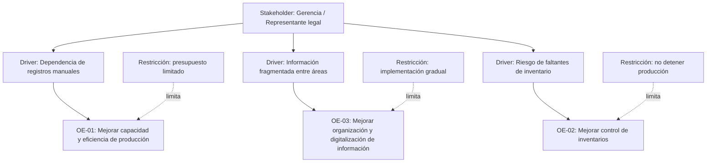
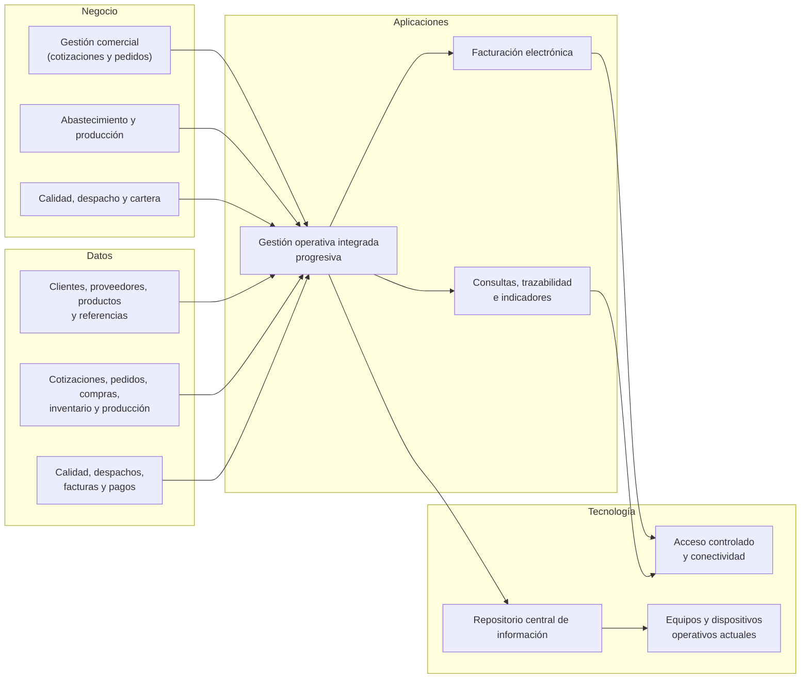

# Architecture Vision

## Visión de arquitectura

Insuclínicos evolucionará de una operación soportada en datos dispersos y actualizaciones manuales hacia una arquitectura progresiva que permita gestionar y relacionar la información de clientes, cotizaciones, pedidos, inventario, compras, producción, calidad, despacho, facturación y cartera.

La visión busca que la empresa pueda conocer el estado de cada pedido y de sus materiales con información más confiable y oportuna, reducir duplicidades y mejorar la coordinación entre áreas. La transformación debe ser gradual, respetar las restricciones presupuestales y operativas, y evitar detener la producción durante su adopción.

## Vista de motivación

## Mapa conceptual de alto nivel

## Beneficios esperados

| Objetivo estratégico | Beneficio esperado | Cómo se mide |
|---|---|---|
| OE-01: Aumentar capacidad y eficiencia de producción | Mayor visibilidad de órdenes, materiales y estado de producción para reducir tiempos improductivos y mejorar la coordinación operativa | Tiempo promedio de producción; unidades por jornada; porcentaje de cumplimiento de órdenes; porcentaje de desperdicio |
| OE-02: Mejorar control de inventarios y materias primas | Mayor confiabilidad de los registros de entrada, consumo y disponibilidad de materiales; reducción de faltantes y compras urgentes | Diferencia entre inventario físico y registrado; número de faltantes; órdenes interrumpidas por falta de insumos |
| OE-03: Mejorar organización y digitalización de información | Trazabilidad del pedido desde cotización hasta factura y reducción de duplicidad de registros entre áreas | Tiempo de consulta del estado de un pedido; porcentaje de pedidos trazables; errores de registro; información duplicada |

## Alcance arquitectónico

| En alcance | Fuera de alcance |
|---|---|
| Documentación AS-IS de procesos, capacidades, actores, datos y flujos de información | Implementación productiva inmediata de un ERP o plataforma integrada |
| Visión de alto nivel de una gestión integrada y gradual de la información | Sustitución inmediata de todas las hojas de cálculo y canales actuales |
| Identificación de oportunidades de integración entre comercial, inventario, producción, calidad, despacho y facturación | Automatización industrial de maquinaria o rediseño físico de planta |
| Definición de entidades de datos, relaciones y responsables de información | Selección final, compra o despliegue de infraestructura tecnológica |
| Diseño de base para roadmap posterior | Certificación regulatoria, cambios de producto o cambios comerciales ajenos al alcance del curso |

## 3.6 Justificación

La visión está alineada con los objetivos estratégicos porque atiende los tres factores identificados por el cliente: eficiencia de producción, control de inventarios y organización de la información. La prioridad no es imponer una herramienta, sino definir una arquitectura que conecte los datos que hoy se administran de forma dispersa y permita a las áreas trabajar sobre información coherente.

La trazabilidad de pedidos conecta ventas, inventario, compras, producción, calidad, despacho, facturación y cartera. Al mejorar la visibilidad de estos flujos, la empresa podrá disminuir la dependencia de mensajes y actualizaciones manuales, identificar faltantes de materiales con mayor anticipación y consultar el estado de la operación sin reconstruirlo desde múltiples fuentes.

La transformación propuesta es gradual y compatible con las restricciones declaradas: presupuesto limitado, continuidad de producción, disponibilidad reducida del personal y protección de datos confidenciales. Las decisiones de aplicaciones e infraestructura se detallarán en el Corte 2; en este corte se documenta el estado actual y la visión de evolución.

---
