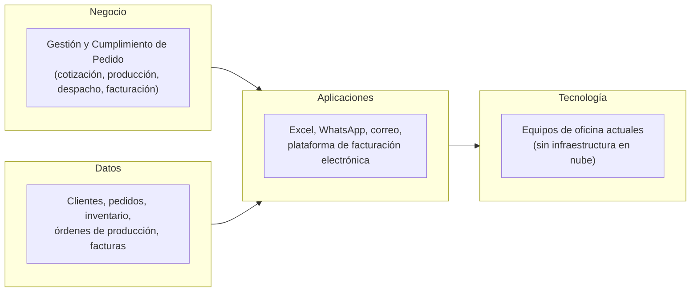

# 📄 Documento de Visión de Arquitectura

## 🔖 Cliente
Insuclínicos Ltda. — Fabricación y comercialización de prendas e insumos médicos desechables en tela quirúrgica.

## 👥 Integrantes del equipo
- Jorge Steven Doncel Bejarano, jorgedobe@unisabana.ecu.co, gevengood 
- David Santiago Buendia Londoño, davidbulo@unisabana.edu.co, usariogithub 

## 🗺️ Mapa conceptual de alto nivel

## 🚀 Beneficios esperados

| Objetivo estratégico (Ficha) | Beneficio esperado | Cómo se mide |
|---|---|---|
| OE-01: Aumentar la capacidad y eficiencia de producción | Reducción de tiempos improductivos y mayor volumen fabricado por jornada | Tiempo promedio de producción, unidades producidas por jornada, % de desperdicio de material |
| OE-02: Mejorar el control de inventarios y materias primas | Menos faltantes de tela quirúrgica e insumos que interrumpan la producción | Diferencias entre inventario físico y registrado, número de faltantes por período |
| OE-03: Mejorar la organización y digitalización de la información | Trazabilidad del pedido visible en tiempo real entre ventas, producción, inventario y facturación | Reducción de registros duplicados, tiempo de consulta del estado de un pedido |

## 🧭 Alcance

> **Nota de alcance académico:** este documento es un ejercicio de diseño arquitectónico dentro del curso AREM. No implica una implementación real ni un compromiso contractual con Insuclínicos Ltda. El único artefacto técnico funcional previsto es un **Proof of Concept (POC)** acotado, a entregar al cierre del semestre, que demuestre de forma parcial uno de los componentes de la arquitectura propuesta (por ejemplo, un flujo de trazabilidad de pedido o una vista de inventario). El resto de la propuesta (arquitectura completa, integración total de áreas, hoja de ruta multi-fase) queda como recomendación conceptual para la empresa, no como entrega funcional del curso.

| En alcance | Fuera de alcance |
|---|---|
| Diagnóstico AS-IS del macro-proceso de Gestión y Cumplimiento de Pedido | Implementación real o puesta en producción de cualquier sistema en Insuclínicos |
| Modelo BPMN detallado del subproceso de producción (orden → producto terminado) | Rediseño de la línea de producción física o compra de maquinaria nueva |
| Propuesta de arquitectura de datos e integración entre ventas, inventario, producción y facturación (a nivel conceptual/documental) | Migración de Excel a un ERP completo, o reemplazo de la plataforma de facturación electrónica |
| Un **POC** acotado al final del semestre, que ilustre un componente puntual de la arquitectura propuesta | Automatización end-to-end de todas las áreas administrativas (RR. HH., nómina, etc.) |
| Hoja de ruta de implementación por fases (corto, mediano, largo plazo) como recomendación | Compromiso de continuidad, soporte o mantenimiento posterior al semestre |

## 💡 Justificación

La visión se centra en el macro-proceso de Gestión y Cumplimiento de Pedido porque es el punto donde confluyen los tres problemas identificados en la Ficha de Caracterización: la fragmentación de la información entre WhatsApp, Excel y papel (Problema #1), el control manual y reactivo del inventario (Problema #2), y la dependencia excesiva del conocimiento de las personas para saber en qué estado está un pedido (Problema #3). Al intervenir este proceso primero, cualquier mejora de trazabilidad beneficia simultáneamente a ventas, producción, inventario, despacho y facturación, que son las áreas mencionadas en el OE-03.

El alcance se mantiene deliberadamente acotado a un diagnóstico, una propuesta conceptual de arquitectura y un POC puntual, sin comprometer una implementación real, porque el curso evalúa la capacidad de análisis y diseño arquitectónico —no la entrega de un producto de software terminado a la empresa—. Esto es coherente además con las restricciones declaradas por el cliente (presupuesto limitado, producción que no puede detenerse, prioridad de aprovechar equipos actuales): cualquier prototipo que se construya debe ser una demostración aislada, sin tocar la operación real de Insuclínicos durante el semestre.

Finalmente, la arquitectura resultante busca ser incremental en su formulación: primero visibilidad y trazabilidad del pedido, después integración de datos entre áreas, y solo en fases posteriores (fuera del alcance de este curso) automatización más profunda, como la del proceso de tendido de tela. El POC de cierre de semestre sirve como evidencia conceptual de que la propuesta es viable, no como el sistema final que Insuclínicos usará en su operación.

---

*Este documento hace parte de la entrega del Taller 0 del curso AREM (Arquitectura Empresarial) - Universidad de La Sabana.*
