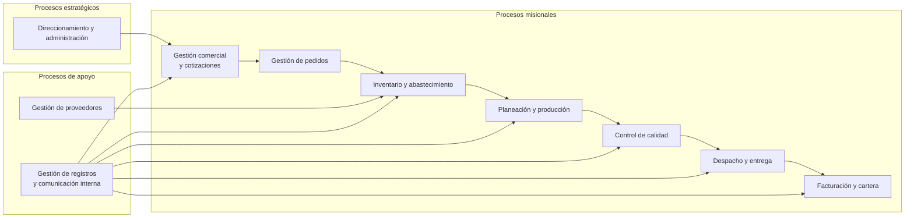
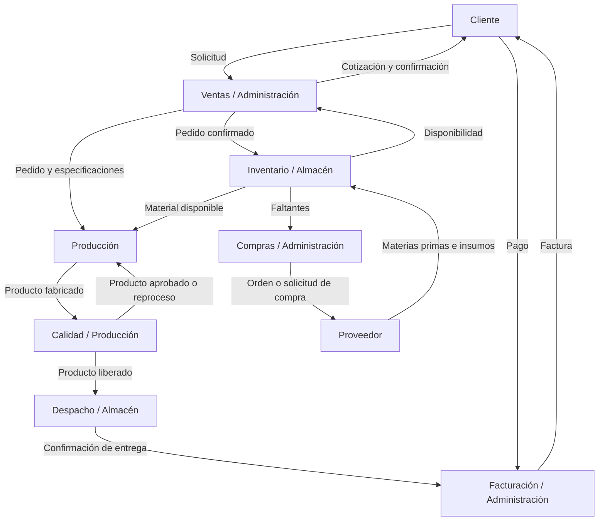
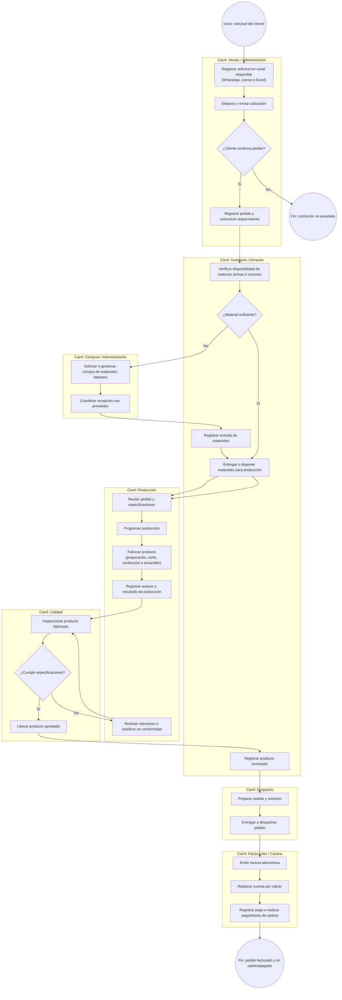

# Business Architecture AS-IS

## Mapa de procesos

## Cadena de valor AS-IS

```mermaid
flowchart LR
    cliente1["Solicitud del cliente"] --> cotizacion["Cotización"]
    cotizacion --> confirmacion["Confirmación del pedido"]
    confirmacion --> inventario["Verificación de inventario"]
    inventario --> decision1{"¿Hay material suficiente?"}
    decision1 -->|Sí| plan["Planeación de producción"]
    decision1 -->|No| compra["Compra de materiales"]
    compra --> ingreso["Ingreso y registro de material"]
    ingreso --> plan
    plan --> fabricar["Producción"]
    fabricar --> calidad["Control de calidad"]
    calidad --> decision2{"¿Producto aprobado?"}
    decision2 -->|No| reproceso["Reproceso / no conforme"]
    reproceso --> calidad
    decision2 -->|Sí| almacenamiento["Almacenamiento de producto terminado"]
    almacenamiento --> despacho["Despacho y remisión"]
    despacho --> factura["Facturación electrónica"]
    factura --> cartera["Cartera y pago"]
```

## Catálogo de capacidades

| Dominio | Capacidad | Descripción AS-IS | Procesos relacionados |
|---|---|---|---|
| Comercial | Gestionar solicitudes y cotizaciones | Recibir requerimientos por canales de comunicación y elaborar ofertas | Gestión comercial |
| Comercial | Gestionar pedidos | Confirmar referencias, cantidades y fechas requeridas | Gestión de pedidos |
| Abastecimiento | Controlar inventario | Registrar y consultar manualmente existencias de materias primas, insumos y producto terminado | Inventario y almacenamiento |
| Abastecimiento | Gestionar compras | Solicitar y recibir materiales faltantes mediante comunicación con proveedores | Compras |
| Producción | Planear producción | Organizar fabricación a partir del pedido confirmado | Planeación de producción |
| Producción | Fabricar prendas e insumos | Preparar materiales, cortar, confeccionar o ensamblar productos | Producción |
| Calidad | Controlar conformidad | Inspeccionar productos y decidir aprobación, reproceso o no conformidad | Control de calidad |
| Logística | Gestionar despacho | Preparar el pedido, generar remisión y entregar al cliente | Despacho |
| Financiero-administrativo | Facturar y gestionar cartera | Emitir facturas electrónicas y gestionar cuentas por cobrar | Facturación y cartera |
| Gobierno | Administrar operación | Coordinar, validar información y tomar decisiones operativas | Direccionamiento y administración |

## 4.4 Mapa de actores e interacciones

## BPMN descriptivo AS-IS — Gestión y cumplimiento de pedido

> El siguiente modelo se presenta en Mermaid como representación documentable del BPMN. En la versión gráfica final se recomienda dibujarlo en Bizagi Modeler, Draw.io o una herramienta BPMN con eventos, tareas, compuertas y carriles.

## Hallazgos del proceso AS-IS

| Punto del proceso | Riesgo o dificultad AS-IS | Consecuencia potencial |
|---|---|---|
| Solicitud, cotización y pedido | Información distribuida entre WhatsApp, correo y Excel | Duplicidad, pérdida de contexto o demoras en la confirmación |
| Verificación de inventario | Actualización manual de existencias | Diferencias entre registro y realidad; faltantes no anticipados |
| Comunicación de órdenes a producción | Comunicación directa y dependencia de Excel | Riesgo de omisión, versión desactualizada o dificultad para rastrear prioridades |
| Compras | Activación reactiva ante faltantes | Compras urgentes y retrasos de producción |
| Registro de producción | Información en papel, Excel o registros internos | Visibilidad limitada del avance de la orden |
| Calidad | Registro interno separado del pedido | Dificultad para relacionar calidad, reproceso y cumplimiento de pedido |
| Despacho y facturación | Información operativa y administrativa no centralizada | Mayor esfuerzo para confirmar entrega, facturar y consultar estado de cartera |

---
