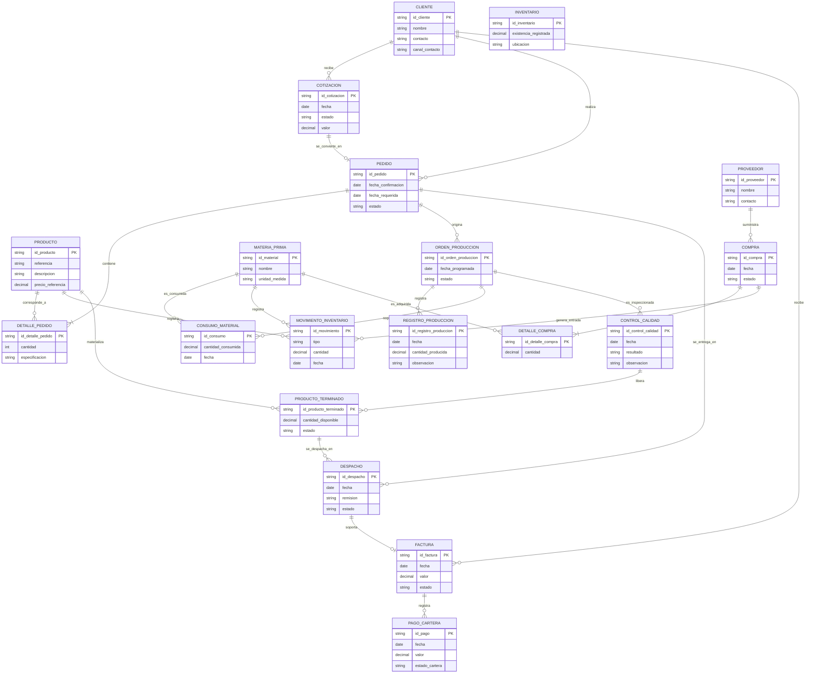
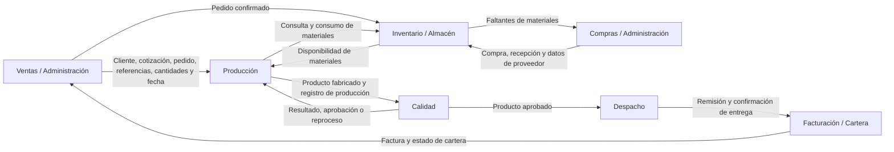

# Arquitectura de Datos AS-IS

## Principios de lectura del modelo

El modelo de datos representa las entidades de negocio identificadas durante el levantamiento. No implica que hoy exista una base de datos integrada: en el estado AS-IS la información se encuentra distribuida en Excel, mensajes, correo, documentos físicos, registros internos, remisiones y plataforma de facturación electrónica.

## Catálogo de entidades

| Entidad | Descripción | Fuente o soporte AS-IS | Responsable principal |
|---|---|---|---|
| Cliente | Organización o persona que solicita, compra y recibe productos | Excel, WhatsApp, correo, registros administrativos | Ventas / Administración |
| Producto / Referencia | Prenda o insumo comercializado, con especificaciones y precio | Excel y archivos internos | Ventas / Producción |
| Cotización | Oferta comercial preparada para un cliente | Excel, correo y WhatsApp | Ventas / Administración |
| Pedido | Solicitud confirmada con referencias, cantidades y fecha requerida | Excel, registros administrativos, WhatsApp y correo | Ventas / Administración |
| Detalle de pedido | Líneas de producto, cantidades y especificaciones de cada pedido | Excel o registros administrativos | Ventas / Producción |
| Orden de producción | Requerimiento interno para fabricar un pedido o parte de este | Excel, registros internos y comunicación directa | Producción |
| Materia prima / Insumo | Material requerido para fabricar productos | Excel, documentos y registros de inventario | Inventario / Producción |
| Inventario | Existencias disponibles de materias primas, insumos y producto terminado | Principalmente Excel y registros manuales | Responsable de inventario |
| Movimiento de inventario | Entrada, consumo, ajuste o salida de un material o producto | Excel y registros manuales | Responsable de inventario |
| Proveedor | Entidad que suministra materiales e insumos | Excel y documentos administrativos | Compras / Administración |
| Compra | Solicitud o adquisición de materias primas e insumos | Facturas y registros administrativos | Compras / Administración |
| Registro de producción | Evidencia del avance o resultado de fabricación | Papel, Excel y registros de producción | Producción |
| Control de calidad | Resultado de inspección, liberación, reproceso o no conformidad | Registros internos | Calidad / Producción |
| Producto terminado | Producto fabricado y aprobado para almacenamiento o despacho | Inventario y registros de producción | Almacén / Producción |
| Despacho / Remisión | Registro de preparación y entrega de productos al cliente | Remisiones y registros administrativos | Despacho / Almacén |
| Factura | Documento electrónico emitido al cliente por el pedido entregado | Plataforma de facturación electrónica | Facturación / Administración |
| Pago / Cartera | Cuenta por cobrar, pago recibido y estado de recaudo | Plataforma de facturación y Excel | Administración / Cartera |
| Empleado / Responsable | Persona que realiza o valida actividades operativas | Documentación administrativa | Gerencia / Administración |

## Modelo lógico de datos AS-IS (SANTIAGO, PASAR ESTO A DRAW.IO)

## Flujo de información AS-IS (SANTIAGO, PASAR ESTO A DRAW.IO)

## Matriz de información por proceso

| Proceso | Crea o actualiza | Consulta o utiliza | Soporte AS-IS |
|---|---|---|---|
| Ventas/cotización | Cliente, cotización, pedido, detalle de pedido | Productos, referencias, precios, estado de pedido | WhatsApp, correo, Excel |
| Inventario | Inventario, movimientos, entradas y consumos | Pedido, orden de producción, materias primas, compras | Excel y registros manuales |
| Compras | Compra, proveedor, detalle de compra | Faltantes, inventario, materias primas | Teléfono, WhatsApp, correo, facturas y registros administrativos |
| Producción | Orden de producción, registro de producción, consumo de materiales | Pedido, detalle de pedido, inventario, especificaciones | Registros internos, papel y Excel |
| Calidad | Control de calidad, reproceso o no conformidad | Registro de producción, producto, especificaciones | Registros internos |
| Despacho | Despacho, remisión | Producto terminado, pedido, aprobación de calidad | Remisiones y registros administrativos |
| Facturación/cartera | Factura, cuenta por cobrar, pago | Pedido entregado, despacho, datos de cliente | Plataforma de facturación electrónica y Excel |

## Problemas de datos AS-IS

- La información se crea y almacena en múltiples medios que no se encuentran integrados automáticamente.
- Excel se utiliza como soporte transversal para inventario, pedidos, organización administrativa y control interno.
- La actualización de inventario depende de una persona y de registros manuales de entrada y consumo.
- La orden de producción se comunica directamente al personal de producción después de organizar el pedido en Excel.
- No existe evidencia de un identificador único integrado que conecte de manera automática pedido, orden de producción, consumo de inventario, control de calidad, despacho y factura.
- La consulta del estado de una orden puede requerir revisar varios archivos, mensajes o registros de áreas distintas.
- La generación de indicadores depende de consolidación manual de datos.

---
